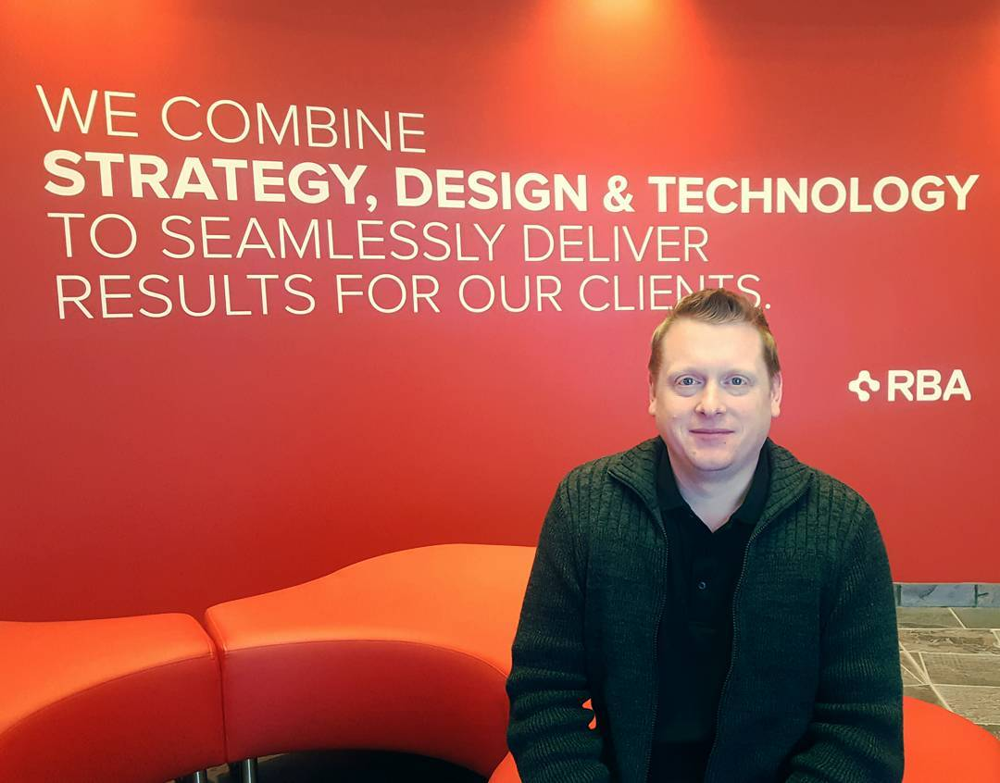

title: "About Me"
date: 2015-05-15 16:41:31
---

Welcome to my blog. I have been a developer for over 17 years, I started using .net in 2002. Back then I worked in a software house building windows based appliactions for the Financial Services industry. After progressing to Web based appliactions in 2005, I started moving into the CMS area, initially using DotNetNuke. 

I finally saw the light and start using Sitecore for the first time in 2008. I currenty work for RBA Consulting as a Principle Solutions Engineer for Sitecore projects. I have delivered a number of large scale Sitecore implementations, winning Sitecore Site of the Year in 2013 for the [Barclays ATP World Tour Finals](http://www.barclaysatpworldtourfinals.com) website. It has been a great experience working with a number of sports websites and dealing with the complexities of integrating a Sitecore CMS with external statistical data and real time live scoring!

This year I am proud to have been awarded Sitecore Technology MVP for the second year running.

I am one third of the [Fortis.ws](http://fortis.ws) Development team, along with [Jason Bert](http://www.jasonbert.com) and Kern Nightingale

I'm looking forward to many more years with Sitecore - its a fantiastic product and the future looks bright! 

I am a certified Sitecore Developer, and OMS Marketer Specialties: ASP.Net, C#, Sitecore CMS Development, Html5, CSS, Less, Sitecore xDB, Sitecore DMS, Web Design, UI Design, SAAS architecture, High volume web architecture, MVC, Javascript, jQuery, AJAX, Linq, Linq2Sql.

\- Richard Seal
\- [http://www.rbaconsulting.com/](http://www.rbaconsulting.com/)

  